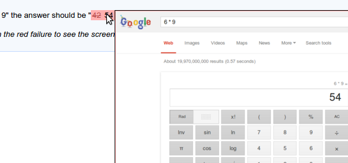

Concordion includes a flexible extension mechanism for adding functionality to Concordion, for example implementing new commands, listening to events, or modifying the Concordion output. It's simple to write your own, or use one of the following:

    

        

            

                

                    <i class="mdi small mdi-shuffle-disabled"></i>
                    Parallel Run
                    
                        <!-- Place this tag where you want the button to render. -->
                        <a class="github-button" href="https://github.com/concordion/concordion-parallel-run-extension" data-count-href="/concordion/concordion-parallel-run-extension/stargazers" data-count-api="/repos/concordion/concordion-parallel-run-extension#stargazers_count" data-count-aria-label="# stargazers on GitHub" aria-label="Star concordion/concordion-parallel-run-extension on GitHub">Star</a>
                    
                    
Run specifications in parallel

                

                

                    <a href="https://github.com/concordion/concordion-parallel-run-extension/blob/master/README.md">README</a>
                    <a href="https://github.com/concordion/concordion-scope-examples">Demo</a>
                

            

        

        

            

                

                    
                

                

                    Excel
                    
                        <a class="github-button" href="https://github.com/concordion/concordion-excel-extension" data-count-href="/concordion/concordion-excel-extension/stargazers" data-count-api="/repos/concordion/concordion-excel-extension#stargazers_count" data-count-aria-label="# stargazers on GitHub" aria-label="Star concordion/concordion-excel-extension on GitHub">Star</a>
                    
                    
Write your specifications in Excel

                

                

                    <a href="https://github.com/concordion/concordion-excel-extension/blob/master/README.md">README</a>
                    <a href="https://github.com/concordion/concordion-excel-extension-tutorial">Tutorial</a>
                

            

        

        

            

                

                    
                

                

                    Storyboard
                    
                        <a class="github-button" href="https://github.com/concordion/concordion-storyboard-extension" data-count-href="/concordion/concordion-storyboard-extension/stargazers" data-count-api="/repos/concordion/concordion-storyboard-extension#stargazers_count" data-count-aria-label="# stargazers on GitHub" aria-label="Star concordion/concordion-storyboard-extension on GitHub">Star</a>
                    
                    
Embed a card sequence with screenshots or data

                

                

                    <a href="https://github.com/concordion/concordion-storyboard-extension/blob/master/README.md">README</a>
                    <a href="https://github.com/concordion/concordion-storyboard-extension-demo">Demo</a>
                

            

        

        

            

                

                    
                

                

                    Screenshot
                    
                        <a class="github-button" href="https://github.com/concordion/concordion-screenshot-extension" data-count-href="/concordion/concordion-screenshot-extension/stargazers" data-count-api="/repos/concordion/concordion-screenshot-extension#stargazers_count" data-count-aria-label="# stargazers on GitHub" aria-label="Star concordion/concordion-screenshot-extension on GitHub">Star</a>
                    
                    
Embed screenshots on failure or on demand

                

                

                    <a href="https://github.com/concordion/concordion-screenshot-extension/blob/master/README.md">README</a>
                    <a href="https://github.com/concordion/concordion-screenshot-extension-demo">Demo</a>
                

            

        

    

Note: Additional contributions are welcome. Please get in touch on the [concordion-dev](http://groups.google.com/forum/#!forum/concordion-dev) list.

<!-- Place this tag right after the last button or just before your close body tag. -->
