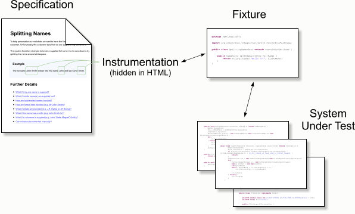

# The Basics

An executable specification consists of two parts: (i) a specification describing the functionality, and (ii) fixture code which executes the system under test.

In order for the magic to happen, the document must first be _instrumented_ with commands. The instrumentation is invisible to a browser, but is processed by the fixture code.

The format of the instrumentation depends on the format of the specification:

<ul class="collapsible collapsible-accordion" data-collapsible="accordion">
  <li>
    
<i class="mdi mdi-markdown"></i>Markdown

    

        
Markdown specifications use links:

        
<pre><code class="markdown">
When [Bob](- "#firstName") logs in 
a greeting [Hello Bob!](- <b>"?=greetingFor(#firstName)"</b>) should be displayed.
        </code></pre>

    

</li>
  <li>
    
<i class="mdi mdi-code-tags"></i>HTML

    

        
HTML specifications use attributes:

        <pre><code class="html">
&lt;p>
    When &lt;<b>span concordion:set="#firstName"</b>>Bob&lt;/span> logs in a greeting
    &lt;span <b>concordion:assertEquals="greetingFor(#firstName)"</b>>Hello Bob!&lt;/span>
    should be displayed.
&lt;/p>        
        </code></pre>
    

</li>
</ul>

The common theme is that the instrumentation is effectively invisible when the specification is previewed. The Markdown and Excel formats have the added benefit that you can hover over the link or comment respectively to see the instrumentation.

# Commands

Concordion has a purposefully small command set to make it easy to learn and use. 

The full command set in Concordion core is:

| Command | Description |
| --------------- | --------------- |
| example | marks a section of the specification as being a named example. Each example is run as a separate test by the test runner. |
| set | sets a specification variable to a text value |
| execute | executes code in the fixture, optionally setting a specification variable with the return value |
| assert-equals | evaluates an expression and asserts the result against a text value |
| verify-rows | compares the contents of a table with the contents of a collection |
| run | runs a linked specification |
| assert-true | evaluates an expression and asserts the result is true |
| assert-false | evaluates an expression and asserts the result is false |
| echo | evaluates an expression and inserts the result into the output HTML |

If needed, additional commands can be implemented as [extensions][TODO].
 
# Formats

## Markdown

Concordion commands are differentiated from other Markdown [links](https://daringfireball.net/projects/markdown/syntax#link) by using a hyphen (`-`) for the URL:

~~~ markdown
    [value](- "command")
~~~

As an alternative to inline links, reference style links are supported, for example:

    [value][id]
    
    [id]: - "command"

or

    [value][]
    
    [value]: - "command"

Reference style links can help improve readability of the Markdown document, especially for table headers or lengthy commands. 

### Commands
A shorthand syntax is provided for the set, assert equals and execute commands.

| Command        | Grammar                   | Example |
| -------------- | ------------------------  | ------- |
| Set            | `[value](- "#varname")`   | `[Jane](- "#name")` |
| Assert Equals  | `[value](- "?=#varname")` | `[Hello Jane!]` `(- "?=#greeting")` |
| Execute        | `[value](- "expression")` | `[The greeting is]` `(- "#greeting=greetingFor(#name)")` |
| Other commands | `[value](- "c:command")`  | `[is notified]` `(- "c:assert-true=isNotified()")` |

#### Table Commands
The Github Flavored Markdown [tables](https://help.github.com/articles/github-flavored-markdown/#tables) syntax is used.

The command to be run on the table is specified in the first table header column, followed by the command for that column (if any), with the commands for each column of the table specified in the table header.

##### Execute on a table
The execute command is specified in the first table header column, followed by the command for that column (if any), with the commands for each column of the table specified in the relevant table header column.

    |[_add_](- "#z=add(#x, #y)")[Number 1](- "#x")|[Number 2](- "#y")|[Result](- "?=#z")|
    | ------------------------------------------: | ---------------: | ---------------: |
    |                                            1|                 0|                 1|
    |                                            1|                -3|                -2|

Reference-style links can be used for one or more of the links to improve readability of the Markdown source: 

    |[_add_][][Number 1](- "#x")|[Number 2](- "#y")|[Result](- "?=#z")|
    | ------------------------: | ---------------: | ---------------: |
    |                          1|                 0|                 1|
    |                          1|                -3|                -2|

    [_add_]: - "#z=add(#x, #y)"

##### Verify Rows
The verifyRows command is specified in the first table header column, followed by the command for that column (if any), with the commands for each column of the table specified in the relevant table header column.

    |[_check GST_][][Sub Total][]|[GST][]|
    | -------------------------- | ----: |
    |                         100|     15|
    |                          20|      2|

    [_check GST_]: - "c:verifyRows=#detail:getInvoiceDetails()"
    [Sub Total]:   - "?=#detail.subTotal"
    [GST]:         - "?=#detail.gst"

Note that reference-style links have been used to improve the readability of this example. Inline links are equally valid. 

#### Example Command
Concordion 2.0 introduces a new [example command](http://concordion.github.io/concordion/latest/spec/command/example/Examples.html).

Adding an inline link to a header changes the header into an example command. You can use either the Atx-style or Setext-style headers. For example:

    ## [Example 1](- "exampleName")

or 

    [Example 1](- "exampleName")
    ----------------------------------

will create an example named `exampleName` with the H2 heading `Example 1`.

##### Closing an example
The example block continues until it is closed either implicitly or explicitly.

An example is implicitly closed on any of these conditions:

* another example starts, or
* a header is encountered that is at a higher level than the example header (eg. the example is a `h3` and a `h2` header is encountered), or
* the end of file is reached.

To explicitly close an example, create a header with the example heading struck-through. For example:  

    ## ~~Example 1~~
    
will close the example with the heading `Example 1`    

__Note:__ the example command requires Concordion 2.0.0 or later.

#### Run Command
Adding a title of `c:run` to an inline link will add a run command to that link. For example:

    [Address](Address.html "c:run")

will run the `Address.html` specification.

---

### Further details
See the [Grammar Specification](MarkdownGrammar.md "c:run") for the full Grammar.

## HTML

TODO - add details of IDEA and Eclipse extensions to instrumentation.md when available..

Concordion specifications can be authored using either Markdown or HTML (alternatively you can use Excel with the [Excel Extension](github.com/concordion/concordion-excel-extension), or [write your own extension](ExtensionsAPI.html) to handle other formats).

## Markdown

Markdown provides an easy-to-read and easy-to-write syntax for specifications.

As a crash course, typing the following:

    # Heading

    This is a __bold text__ in a paragraph

    ## Subheading

    | Name              | Age |
    | ---------------------- | --- |
    | Fred Flintstone | 35 |
    | Betty Rubble    | 27 |

results in:

-----------

# Heading

This is a __bold text__ in a paragraph

## Subheading

| Name              | Age |
| ---------------------- | --- |
| Fred Flintstone | 35 |
| Betty Rubble    | 27 |

-----------

For further details, read the Markdown [basics](https://daringfireball.net/projects/markdown/basics) and [syntax](https://daringfireball.net/projects/markdown/syntax).

In addition to standard Markdown, Concordion supports: 
* MultiMarkdown format [tables](http://fletcher.github.io/MultiMarkdown-4/tables.html). If using Github, you might want to limit yourself to github flavored markdown tables.
* strikethrough format using `~~tildes around the words~~`.

For syntax that is not covered by Markdown, you can use inline HTML.

### Extending the Markdown syntax

Markdown extensions allow you to change and/or extend the behaviour of the Markdown parser, for example to change the behaviour of new lines, or to support definition lists.

See the [MarkdownExtensions](http://concordion.github.io/concordion/latest/javadoc/org/concordion/api/option/MarkdownExtensions.html) javadoc for a definition of the available extensions.

_Note that the Concordion fixture will need to be [configured](http://concordion.github.io/concordion/latest/spec/annotation/ConcordionOptions.html) to enable the markdown extensions._

### Markdown editors

While you can edit Markdown in a text editor, you'll get additional features such as preview, syntax highlighting and auto indent with a Markdown editor. There are lots of options available, including online editors, plugins to text editors such as Notepad++ and dedicated Markdown editors. If you wish to use any of the Markdown extensions (see above), you might want to make sure your editor supports it.

#### Github 
The syntax used for this extension is compatible with Github Flavored Markdown, allowing specifications to be edited and previewed in the Github editor.

#### IDEA
The official IntelliJ IDEA Markdown editor is not recommended since it does not support tables. 
Instead, the [Markdown](https://plugins.jetbrains.com/plugin?id=5970) plugin is recommended. 
This plugin uses the same underlying Pegdown library as the Concordion Markdown extension. 
After installing the plugin, you will need to configure the [settings](https://plugins.jetbrains.com/files/5970/screenshot_14568.png) to enable Tables and Strikethrough, plus any additional Markdown language extensions that you [configure](../../annotations/ConcordionOptions.html).

#### Eclipse
Available Eclipse plugins include:

| Plugin | Has editor? | Has viewer? | Viewer supports tables and strikethrough |
|--------|:-----------:|:-----------:|:----------------------------------------:|
|Mylyn Wikitext Editor| Y | Y | N |
|[Markdown Text Editor](https://marketplace.eclipse.org/content/markdown-text-editor)| Y | N | N |
|[Github Flavored Markdown Viewer](https://marketplace.eclipse.org/content/github-flavored-markdown-viewer-plugin)| N | Y | Y |

In order to have editing features and the ability to view with tables and strikethrough, you may want to install either of the first 2 editor plugins listed along with the viewer plugin.

_Please let us know what editor you are using, and what support you get from it. Either edit this page and raise a pull request or create an issue on this project to let us know. Thanks :)_

## HTML

Prior to Concordion 2.0, HTML was the only specification format available in Concordion core. It remains the canonical format.

While typically only a very small subset of HTML is needed (eg. &lt;p&gt;, &lt;table&gt;, &lt;b&gt;), HTML syntax provides more advanced formatting than Markdown should you need it.

Concordion requires that the HTML be well-structured XHTML, ie. each start tag must have a corresponding end tag.

### Crash Course in HTML

HTML documents are written in text with special start and end tags around items. For example:

    
This is a paragraph

The tag &lt;p&gt; signals the start of the paragraph and &lt;/p&gt; signals the end.

You can nest tags.

    
This is <b>bold text</b> in a paragraph

When the document is displayed in a web browser, it will be rendered like this:

This is __bold text__ in a paragraph

The syntax for a table is more complicated, but once you understand this, you'll have everything you need to write tests in Concordion.

A table uses the following tags: &lt;table&gt;, &lt;tr&gt; (table row) , &lt;th&gt; (table heading), &lt;td&gt; (table data). The table is expressed row by row. The first row contains the headings, the following rows are data. For example:

    <table>
        <tr>
            <th>Name</th>
            <th>Age</th>
        </tr>
        <tr>
            <td>Fred Flintstone</td>
            <td>35</td>
        </tr>
        <tr>
            <td>Betty Rubble</td>
            <td>27</td>
        </tr>
    </table>

Which produces:

----

<table>
    <tr>
        <th>Name</th>
        <th>Age</th>
    </tr>
    <tr>
        <td>Fred Flintstone</td>
        <td>35</td>
    </tr>
    <tr>
        <td>Betty Rubble</td>
        <td>27</td>
    </tr>
</table>

----

### HTML editors

While you can edit HTML in a text editor, you'll get additional features such as preview, syntax highlighting and auto indent with a HTML editor. There are lots of options available, including online editors, plugins to text editors such as Notepad++ and dedicated HTML editors.

TODO - add details of IDEA and Eclipse extensions to instrumentation.md when available..