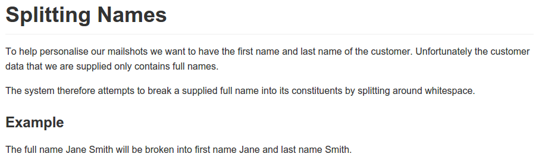
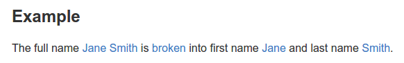

<meta charset="utf-8">
# Tutorial

This runs through the basics of creating living documents using Concordion. 

Creating a living document is a 3 step process:

1. Authoring
2. Instrumenting
3. Coding

Depending on your skillset and role you might be involved in one or more of these steps.

To follow along the tutorial, we've created a template project you can [download](https://github.com/concordion/concordion-tutorial-2.0/archive/master.zip) (or [fork](https://github.com/concordion/concordion-tutorial-2.0#fork-destination-box) if you have a Github account).

## 1. Authoring

The first step is to create a specification of the new feature. In the `src/test/resources/marketing/mailshots` folder of the tutorial project, edit the file `SplittingNames.md` to contain the following.

    # Splitting Names
    
    To help personalise our mailshots we want to have the first name and last name of the customer. 
    Unfortunately the customer data that we are supplied only contains full names.
    
    The system therefore attempts to break a supplied full name into its constituents by splitting 
    around whitespace.
    
    ### Example
    
    The full name Jane Smith is broken into first name Jane and last name Smith.

This uses a formatting language called Markdown, which makes it easy to create rich documents using plain text. 
The `#` characters at the start of the line create headings, where the heading level is determined by the number of `#` characters.

Previewing our [specification](https://github.com/concordion/concordion-tutorial-2.0/blob/authoring/src/test/resources/marketing/mailshots/SplittingNames.md) in Github, or in an editor that supports Markdown, we see it looks like

The team are happy with the specification, so we share it (for example, by adding the file to our version control system).

[Find out more](/authoring) about authoring specifications.

## 2. Instrumenting

In order to execute the example in the specification, we _instrument_ it with commands.

The first step is to select the parts of the example that relate to _context_ (preconditions), _actions_ and _outcomes_. In this case, the context is the name `Jane Smith`, the action is `broken` and the outcomes are the first name `Jane` and last name `Smith`. We select these parts of the example using Markdown's link syntax:

    The full name [Jane Smith]() is [broken]() into first name [Jane]() and last name [Smith]().

Previewing our [specification](https://github.com/concordion/concordion-tutorial-2.0/blob/instrumenting-links/src/test/resources/marketing/mailshots/SplittingNames.md), we now see the example looks like 

Next, we add commands to the links:

    The full name [Jane Smith](- "#name") is [broken](- "#result = split(#name)") 
    into first name [Jane](- "?=#result.firstName") and last name [Smith](- "?=#result.lastName").

These commands are:

1. setting our _context_, by setting a new variable `#name` to the value `Jane Smith`
2. executing our _action_, by executing the method `split()` with the variable `#name` and returning the value `#result`
3. verifying our _outcomes_, by checking whether `#result.firstName` is set to `Jane`, and `#result.lastName` is set to `Smith`.

Previewing our [specification](https://github.com/concordion/concordion-tutorial-2.0/blob/instrumenting-commands/src/test/resources/marketing/mailshots/SplittingNames.md), we can hover over the links to see the command on each link 

.

[Find out more](/instrumenting) about instrumenting fixtures.

## 3. Coding

Finally we create some code, called a _fixture_, that links the instrumented specification with the system under test.

In the `src/test/java/marketing/mailshots` folder of the tutorial project, create the file `SplittingNames.java` containing the following:

    package marketing.mailshots;
    
    import org.concordion.integration.junit4.ConcordionRunner;
    import org.junit.runner.RunWith;

    @RunWith(ConcordionRunner.class)
    public class SplittingNamesFixture {
    
    }

You may have noticed that the fixture is implemented as a JUnit runner. If you run the fixture as a JUnit test, the output should look something like this:

<!-- TODO copy to img folder -->

The test of the example is failing since we haven't implemented the `split()` method. We'll flesh out our fixture code:

    package marketing.mailshots;

    import org.concordion.integration.junit4.ConcordionRunner;
    import org.junit.runner.RunWith;
    
    @RunWith(ConcordionRunner.class)
    public class SplittingNamesTest {
    
        public Result split(String fullName) {
            return new Result();
        }
    
        class Result {
            public String firstName = "TODO";
            public String lastName = "TODO";
        }
    }

Run it now and you get:

<!-- TODO copy to img folder -->

Let's implement the function. Obviously the implementation should be in the real system not in the test case, but just for fun...

    package marketing.mailshots;
    
    import org.concordion.integration.junit4.ConcordionRunner;
    import org.junit.runner.RunWith;
    
    @RunWith(ConcordionRunner.class)
    public class SplittingNamesTest {
    
        public Result split(String fullName) {
            Result result = new Result();
            String[] words = fullName.split(" ");
            result.firstName = words[0];
            result.lastName = words[1];
            return result;
        }
    
        class Result {
            public String firstName;
            public String lastName;
        }
    }

The test now passes:

<!-- TODO copy to img folder -->

[Find out more](/coding) about coding fixtures.
